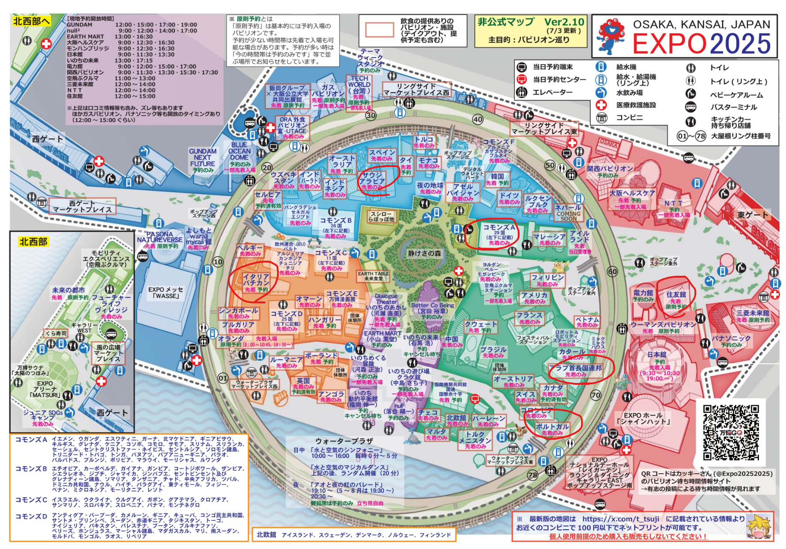
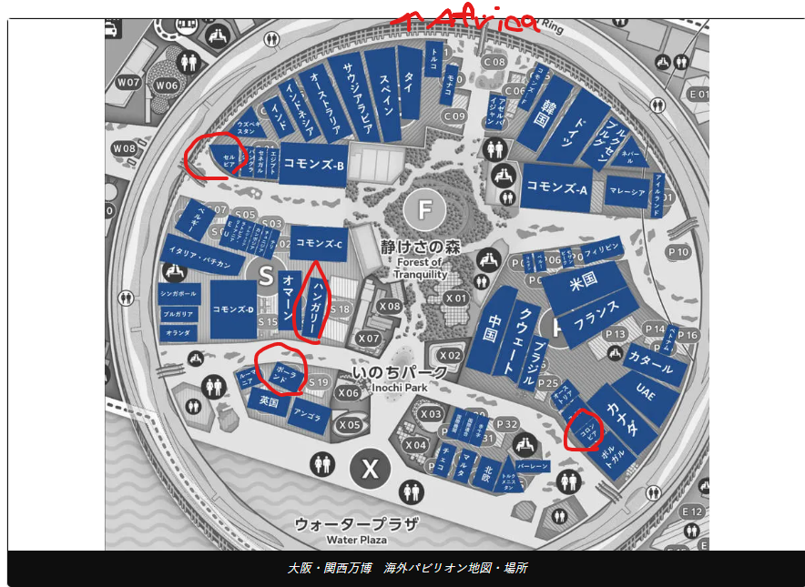

# 大阪万博2025
## 前提
* 入場可能時間は10時
* 行き：新大阪駅～夢洲（電車）
* 帰り：夢洲～新大阪（シャトルバス） or （電車）

## やりたいこと
### 食べる
* イタリア館：ジェラート
* サウジアラビア館：スパイスコーヒー
+ コモンズA：カヌレパフェ
+ UAE館：ラクダミルク
### 遊ぶ
* 住友館のシャツ
* コモンズA～F見て回る

## マップ
### 行きたいパビリオン

### 行きたいレストラン

## 行動計画
|開始|終了|場所|
|:-:|:-:|:--|
|10:00|11:00|住友館|
|11:00|12:00|UAE館|
|12:00|13:00|コモンズA|
|13:00|14:00|サウジアラビア館|
|14:00|15:00|イタリア・バチカン館|
|15:00|16:00|自由|
|16:00|17:00|ポルトガル館|
